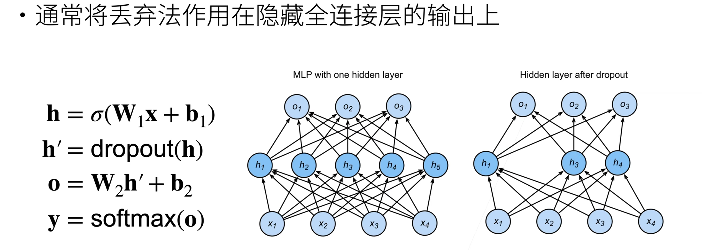

## AlexNet

### ReLU函数

AlexNet神经网络以ReLU函数替代了sigmoid或tanh函数，$ReLU(x) = max(0, x)$。实践证明，这样做可以让网络训练以更快的速度收敛。

解释来自这个[视频 05:17](https://www.bilibili.com/video/BV1qf4y1x7kB/?p=82&share_source=copy_web&vd_source=340f3fe423cd0f0f68fb72953f912437&t=317)：我们假定大于零和小于零的概率是差不多的，有了这个激活函数，每一层**激活的神经元大概只有一半左右**，另一半都是零，这样每一层我们都只训练一半的数据，由此我们可以相对有效地控制收敛速度。

此外，AlexNet将sigmoid激活函数改为更简单的ReLU激活函数。 一方面，ReLU激活函数的计算更简单，它不需要如sigmoid激活函数那般复杂的求幂运算。 另一方面，当使用不同的参数初始化方法时，ReLU激活函数使训练模型更加容易。 当sigmoid激活函数的输出非常接近于0或1时，这些区域的梯度几乎为0，因此反向传播无法继续更新一些模型参数。 相反，ReLU激活函数在正区间的梯度总是1。 因此，如果模型参数没有正确初始化，sigmoid函数可能在正区间内得到几乎为0的梯度，从而使模型无法得到有效的训练。

### 池化

### 随机丢弃

随机丢弃(Dropout)。为了避免系统参数更新过快导致过拟合，每次利用训练样本更新参数时候，随机的“丢弃”一定比例的神经元，被丢弃的神经元将不参加训练过程，输入和输出该神经元的权重系数也不做更新。这样每次训练时，训练的网络架构都不一样，而这些不同的网络架构却分享共同的权重系数。实验表明，随机丢弃技术减缓了网络收敛速度，也以大概率避免了过拟合的发生。

它的实验结果跟正则项的效果一样，所以现在也可以认为它就是一个正则项。（正则化技术能够有效避免模型过拟合，提高模型的泛化能力。）

